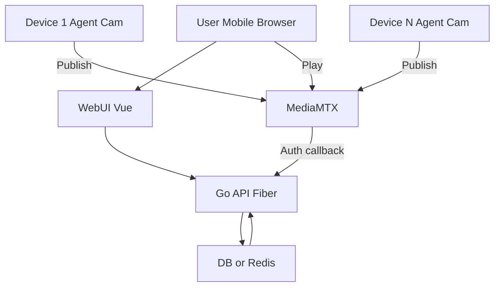
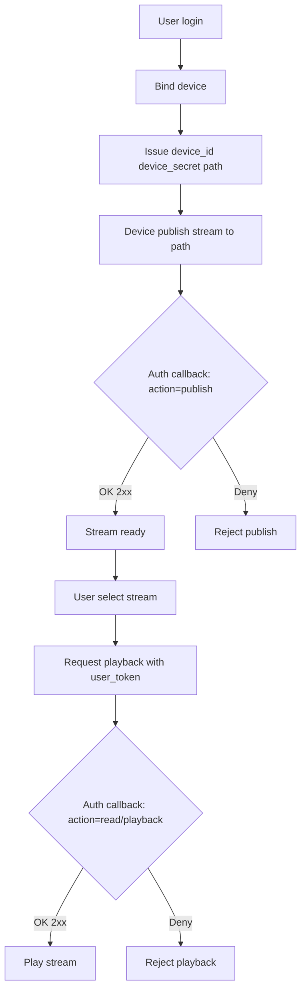
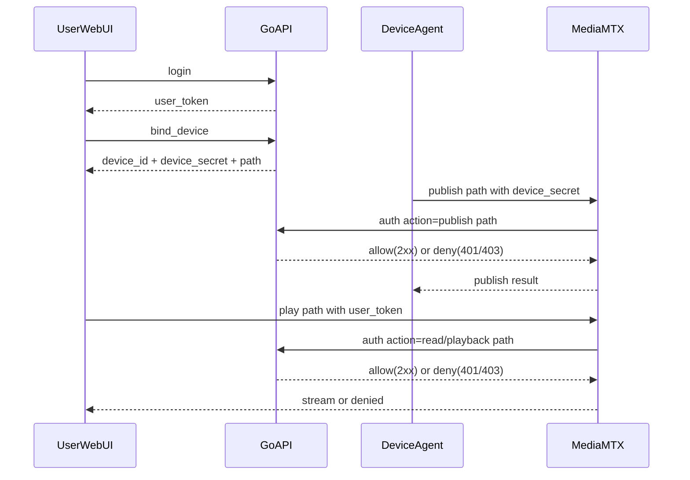

# Paw Stream Server 后端项目说明

> 目标：用一份结构清晰的文档描述系统的“控制面（Go/Fiber 业务服务）+ 媒体面（MediaMTX）+ 设备端推流 + WebUI 播放”的闭环，并让 AI 能直接据此生成实现与测试方案。

***

## 1. 核心组件与职责

- **WebUI（Vue）**：用户登录、绑定设备、选择画面播放；向 Go API 请求业务数据（设备列表、可看路径等）。
- **Go API（Fiber）**：业务用户体系（注册/登录）、设备注册/绑定、权限模型（谁能 publish / 谁能 read），并提供 MediaMTX 的鉴权回调接口 `/mediamtx/auth`。
- **DB/Redis**：存储 users/devices/paths/ACL、device_secret、会话或 JWT 相关数据。
- **Device Agent（设备端）**：采集 USB 摄像头并推流到 MediaMTX（前期 FFmpeg/GStreamer，后期 Go 常驻 Agent）。
- **MediaMTX**：媒体服务器；负责接收设备推流、向浏览器提供 WebRTC/HLS 等播放；在 publish/read/playback 等动作发生时回调 Go API 做鉴权。

***

## 2. 关键数据模型

- `user_id`：业务用户唯一标识。
- `device_id`：设备唯一标识（“一块开发板/一组摄像头”的逻辑设备）。
- `device_secret`：设备推流凭证（随机串，可轮换/禁用）。
- `publish_path`：设备允许 publish 的路径（建议与 device_id 绑定，如 `dogcam/<device_id>`）。
- `user_token`：用户登录态（JWT 或 session token），用于 read/playback 授权。

***

## 3. 架构图



***

## 4. 流程图

> 闭环：用户注册/登录 → 绑定设备 → 下发 device_secret/path → 设备推流（publish 鉴权）→ 用户播放（read/playback 鉴权）。



***

## 5. 时序图（入网、推流、播放）



***

## 6. Project Layout（后端代码结构）

```text
paw-stream-server/
├── cmd/
│   └── api/
│       └── main.go
├── internal/
│   ├── app/
│   │   └── api/
│   │       ├── app.go              # 组装 Fiber、依赖注入、路由注册
│   │       └── routes.go           # 统一挂载路由
│   ├── config/
│   │   ├── config.go              # yaml 配置读取
│   │   └── defaults.go
│   ├── transport/
│   │   └── http/
│   │       ├── middleware/
│   │       │   ├── auth_user.go    # 解析业务 JWT（给业务 API 用）
│   │       │   ├── request_id.go
│   │       │   └── logger.go
│   │       └── handlers/
│   │           ├── auth_handler.go           # /api/register /api/login
│   │           ├── device_handler.go         # /api/devices（业务系统内的设备管理）
│   │           ├── path_handler.go           # /api/paths（列出用户可看的 paths）
│   │           └── mediamtx_auth_handler.go  # /mediamtx/auth（MediaMTX 鉴权回调入口）
│   ├── domain/
│   │   ├── user/
│   │   │   ├── model.go
│   │   │   ├── service.go
│   │   │   └── repo.go
│   │   ├── device/
│   │   │   ├── model.go            # device_id, device_secret, owner_user_id...
│   │   │   ├── service.go          # register/bind/disable/rotate-secret
│   │   │   └── repo.go
│   │   └── acl/
│   │       ├── policy.go           # canPublish(), canRead()
│   │       └── service.go
│   ├── integration/
│   │   └── mediamtx/
│   │       ├── authz.go            # MediaMTX 回调 -> 业务授权决策
│   │       └── types.go            # 回调请求结构体（Action/Path/Protocol/User/Pass/Token...）
│   ├── store/
│   │   ├── postgres/
│   │   │   ├── db.go
│   │   │   ├── user_repo.go
│   │   │   └── device_repo.go
│   │   └── memory/                # 最小可验证时用内存实现，后续可切 DB
│   │       ├── user_repo.go
│   │       └── device_repo.go
│   └── pkg/
│       ├── jwtutil/               # 签发/校验 JWT（业务用户）
│       ├── idgen/                 # device_id、secret 生成
│       └── errors/                # 统一错误码与错误包装
├── api/
│   └── openapi.yaml               # 业务 API 文档（可选）
├── deployments/
│   ├── docker-compose.yaml
│   └── mediamtx.yml
├── scripts/
│   ├── dev_run.sh
│   └── migrate.sh
├── go.mod
└── README.md
```

***

## 数据库设计

用户表、设备表
CREATE EXTENSION IF NOT EXISTS pgcrypto;

-- 用户
CREATE TABLE IF NOT EXISTS users (
  id            uuid PRIMARY KEY DEFAULT gen_random_uuid(),
  username      text NOT NULL UNIQUE,
  nickname      text,
  password_hash text NOT NULL,
  disabled      boolean NOT NULL DEFAULT false,
  created_at    timestamptz NOT NULL DEFAULT now(),
  updated_at    timestamptz NOT NULL DEFAULT now()
);

-- 设备（1设备=1路流，所以把 publish_path 直接放到 devices）
CREATE TABLE IF NOT EXISTS devices (
  id                    uuid PRIMARY KEY DEFAULT gen_random_uuid(),
  owner_user_id         uuid NOT NULL REFERENCES users(id) ON DELETE CASCADE,

  name                  text NOT NULL,
  location              text,

  publish_path           text NOT NULL UNIQUE, -- e.g. dogcam/<device_id>
  secret_hash            text NOT NULL UNIQUE, -- 用于鉴权匹配（hash 后存）
  secret_cipher          bytea NOT NULL,       -- 用于“复制 secret”时解密取回（密文）
  secret_version         int  NOT NULL DEFAULT 1,

  disabled              boolean NOT NULL DEFAULT false,
  created_at            timestamptz NOT NULL DEFAULT now(),
  updated_at            timestamptz NOT NULL DEFAULT now()
);

CREATE INDEX IF NOT EXISTS idx_devices_owner ON devices(owner_user_id);


